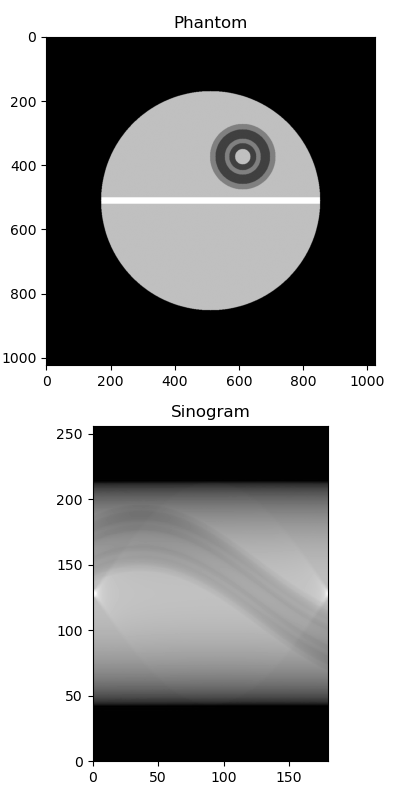
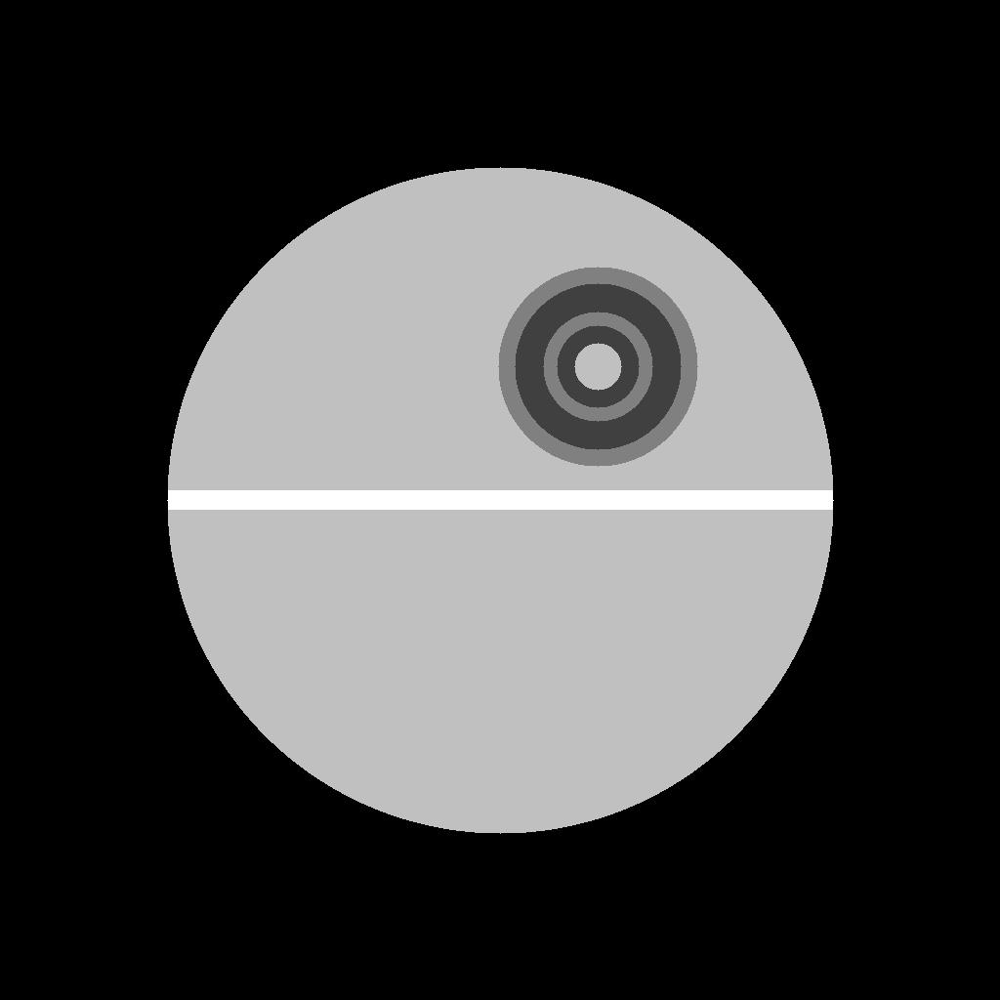
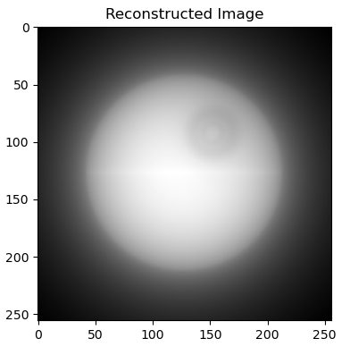

# Sinogram reconstruction

A sinogram refers to the data generated during a computed tomography (CT) scan. During a CT, a patient is positioned on a motorized table, which moves through a donut-shaped machine known as the CT scanner. This machine houses an X-ray tube and detectors. The X-ray tube emits a fan-shaped beam of X-rays as it rotates around the patient. The detectors on the opposite side of the machine measure the X-rays that pass through the patient's body.

As the X-ray tube and detectors rotate, they acquire multiple sets of projection data from different angles. Each set of projection data represents how X-rays are attenuated as they pass through the body. These data are collected as one-dimensional profiles called "projections."

The collected projections from various angles are assembled into a two-dimensional array, which is known as the sinogram. The sinogram represents how X-ray attenuation varies as a function of both angle and position along the detectors.

The sinogram is used to reconstruct a cross-sectional image of the patient's body using the Filtered Back Projection (FBP), iterative reconstruction algorithms or DL based algorithms.  In FBP, the sinogram data is typically filtered to emphasize lower spatial frequencies and reduce noise. This step helps improve the quality of the reconstructed image.

The filtered sinogram data is back-projected to form an image. During back projection, each data point in the sinogram contributes to the values of multiple pixels in the reconstructed image. This process is repeated for all angles, and the results are summed up.

The final outcome is a two-dimensional cross-sectional image that, if appropriately normalized, represents the X-ray attenuation coefficients within the patient's body. This reconstructed image is what you typically see in the final CT scan report.

The reconstructed CT image provides valuable information to healthcare professionals, allowing them to visualize the internal structures of the patient's body. It is widely used in medical diagnosis, treatment planning, and monitoring. CT images are especially useful in identifying abnormalities, such as tumors, fractures, or other medical conditions.

## Filtered Back Projection (FBP)

Filtered Back Projection (FBP) is a common image reconstruction technique used in computed tomography (CT) and other medical imaging modalities. Its primary purpose is to reconstruct an image from a set of projection data (sinogram) acquired by rotating an X-ray or other radiation source around an object. FBP was used to create cross-sectional images of the interior of an object. FBP is based on principles from the Radon transform and Fourier analysis. Here's an overview of the mathematical steps involved in FBP.

The Radon transform is a mathematical operation that takes an image and produces a set of line integrals (projections) at different angles. Let's denote the Radon transform of an image $f(x, y)$ at an angle $\theta$ and a distance $s$ from the origin as $Rf(\theta, s)$.

FBP starts with these Radon projections and uses the filtered back projection formula to reconstruct the image. The formula can be expressed as follows:

$$
g(x,y) = \frac{1}{2\pi}\int_{0}^{\pi}\int_{-\infty}^{+\infty}Rf(\theta,s)w(\theta,s,x,y)dsd\theta
$$

where:

* $g(x,y)$ is the reconstructed image
* $Rf(\theta, s)$ is the Radon transform (i.e. sinogram) of the original image.
* $\theta$ is the angle of the projection.
* $s$ is the distance from the origin along the projection line.
* $(x, y)$ are the coordinates in the reconstructed image.
* $w(\theta,s,x,y)$ is a weighting function that depends on the geometry of the imaging system.

The key to FBP is the filtering step, which aims to emphasize lower spatial frequencies while suppressing higher frequencies. The choice of filter depends on the desired image quality and can include filters like the Ram-Lak, Shepp-Logan, or Hanning filter. The filtered Radon data is obtained by multiplying $Rf(\theta, s)$ by the filter function in the frequency domain.

After filtering, the filtered Radon data is back-projected to create the reconstructed image. Back projection involves taking each filtered projection and spreading it back along the path it came from. This is done for all angles $\theta$, and the results are summed to create the final image $g(x, y)$

## Exercise

In this hands-on class you will:

* Create an image.
* Write the function which creates the sinogram of the image.
* Write the function which performs the Back Projection.
* Write the function that uses the fourier transform to filter the image.
* Create a database of images and projections.
* Train a CNN to reconstruct an image starting from a sinogram.

### Create an image

Write a code which generates an image such as:

tips:

* use numpy
* use a shape which is multiple of 2 (256, 512, 1024, ...)
* check what you can do with numpy.ogrid()

### Radon Transform the image

Now generate the projections of your image (or you may use [this data](data/phantom.npy)). The function is straight forward, rotate your image aroud it's center and then sum all the values along an axis. The following image shows a detector with 256 pixels and 180 projections from $\theta$ = 0 to $\theta$ + 180

### Back Projection

Write the fuction which transforms your image from the sinogram space to the original $(x,y)$ coordinate system. Follow the initial paragraphs of this class to better understand how to implement this algorithm. The result without filtering should look like this:

