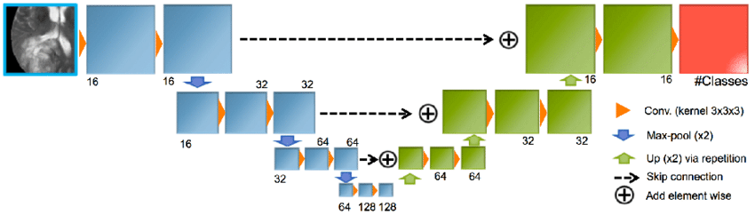

# 3D lung segmentation

In these notebooks, we will implement a 3D convolutional U-NET designed to segment lung volumes. The exercises provided aim to enhance your understanding of U-NET, guiding you through the training pipeline management and the evaluation of a deep neural network's outcomes.

The U-NET stands out as a widely used neural network architecture for semantic segmentation tasks, where the objective is to assign a label to each pixel in an input image or volume. Introduced by Olaf Ronneberger, Philipp Fischer, and Thomas Brox in their 2015 paper, "U-Net: Convolutional Networks for Biomedical Image Segmentation," this architecture comprises two main components: a contracting path and an expanding path.

The contracting path focuses on capturing context and extracting features from the input image or volume. It consists of multiple encoder blocks, each featuring two convolutional layers followed by a max pooling layer. The convolutional layers extract features, while the max pooling layers reduce spatial resolution and increase the number of feature channels, facilitating the capture of global context and abstract features.

Conversely, the expanding path is responsible for generating the final segmentation mask. It comprises multiple decoder blocks, each featuring an upsampling layer followed by two convolutional layers. The upsampling layer increases spatial resolution, and the output is concatenated with corresponding feature maps from the contracting path. This fusion combines low-level features from the contracting path with high-level features from the expanding path, enhancing the accuracy of the segmentation mask.

The UNET architecture's innovative use of skip connections connects corresponding feature maps from the contracting path to the expanding path. This incorporation preserves spatial information and empowers the network to recover fine-grained details in the final segmentation mask. At the end of the expanding path, a 1x1 convolutional layer with a sigmoid activation function generates the final segmentation mask, producing a probability map indicating the likelihood of each pixel belonging to the target class.

The image shows a representation of a UNet structure [2]. The tipical features of a UNet are:
* Left decoding layers
* bottleneck layer (i.e. lowest part of the network)
* Right encoding layers
* Residual sum from decoding to encoding

## Workflow

I suggest to follow this order of execution:

1. 3D medical images: to understand how to manage 3D data
2. Upsampling or Convolutional transpose ? to understand how the decompression layers work.
3. Lung Segmentation: to implement the UNET, training and infer from test data.

## Data

The dataset employed in the Lung CT Segmentation Challenge (LCTSC) 2017 [1] was designed for a competition focusing on the development of algorithms dedicated to the segmentation of various organs at risk in CT images, specifically for radiation treatment planning. This dataset draws from data gathered at three distinct institutions, incorporating a total of 60 CT scans. It is bifurcated into two subsets: one comprising 36 scans allocated for training purposes (36-LCTSC), and the other containing 24 scans earmarked for evaluating the performance of the developed models (24-LCTSC).

The scans exhibit variability along the z-axis, ranging from 103 to 279 slices, with an axial resolution of 512 × 512. The slice spacing is approximately 1.02 ± 0.11 mm, and the slice thickness is approximately 2.65 ± 0.38 mm. The ground truth associated with the original images entails the delineation of five anatomical structures: esophagus, heart, left and right lungs, and spinal cord. Given that the primary focus of this work centers on the lungs, a binary ground truth was created for each slice, isolating only the pulmonary regions. This was achieved by extracting relevant organ information from the DICOM RSTRUCT file.

## References

[1] Yang, J., Sharp, G., Veeraraghavan, H., Van Elmpt, W., Dekker, A., Lustberg, T., & Gooding, M. (2017). Data from Lung CT Segmentation Challenge (LCTSC) (Version 3) [Data set]. The Cancer Imaging Archive. https://doi.org/10.7937/K9/TCIA.2017.3R3FVZ08 [https://wiki.cancerimagingarchive.net/pages/viewpage.action?pageId=24284539](https://wiki.cancerimagingarchive.net/pages/viewpage.action?pageId=24284539) (accessed on 20 December 2021).

[2] Kamnitsas, Konstantinos, et al. "Ensembles of multiple models and architectures for robust brain tumour segmentation." International MICCAI brainlesion workshop. Springer, Cham, 2017.